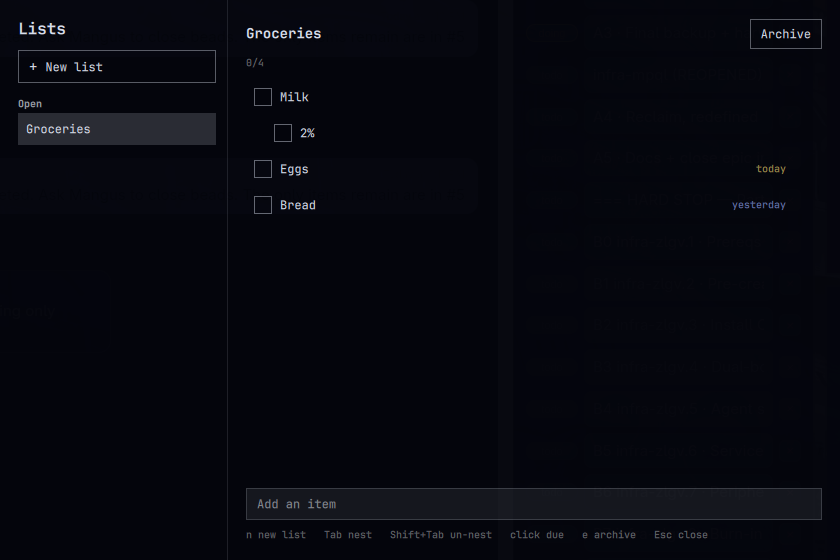

# Lists

Checklists for [Omarchy](https://omarchy.org/), version 1.2.0. A **Lists**
icon sits on the menu bar. Click it to open a window. The same command is
available from the Super menu.



Lists stay on this machine, in one JSON file. Nothing is uploaded.

- Sidebar of open lists, plus an **Archived** section
- Drag the **⋮** grip to reorder lists, and to reorder items
- Drop an item on the middle of a row to nest it; drop on the top or bottom edge to place it beside that row
- Check buttons, rename in place, and fold a row that has nested items
- Due dates (`today`, `tomorrow`, `week`, `+3`, or `YYYY-MM-DD`). Overdue turns the bar icon urgent
- Search across list titles and items
- Pin a list, duplicate it, hide completed rows, or clear them
- Undo the last change
- **Archive** when a list is done; **Unarchive** or **Delete** from the archive

## Install

```bash
omarchy plugin add https://github.com/novique-ai/omarchy-lists.git --enable
```

That clones the plugin into `~/.config/omarchy/plugins/novique.lists/` and
places **Lists** on the right of the bar. Add a Super-menu entry if you want
one:

```jsonc
"lists": {
  "icon": "󰷉",
  "label": "Lists",
  "description": "Simple checklists",
  "action": "omarchy-shell shell summon novique.lists '{}'"
}
```

in `~/.config/omarchy/extensions/omarchy-menu.jsonc`.

To float the window instead of tiling it, add to `~/.config/hypr/hyprland.lua`:

```lua
o.window({ class = "^org.quickshell$", title = "^Lists$" }, {
  float = true,
  center = true,
  size = { 864, 560 },
})
```

## Use

| Action | How |
|---|---|
| Open | Menu bar icon, Super menu → Lists, or `omarchy-shell shell summon novique.lists` |
| New list | **New list**, or `n` |
| Add item | Type in **Add an item**, Enter |
| Check | Click the square, or Space on the focused row |
| Rename | Click the title or the item text, or Enter on the focused row |
| Reorder lists | Drag the **⋮** on a sidebar row. `[` and `]` move the open list |
| Reorder items | Drag the **⋮** on a row. `J` / `K` move it among its siblings |
| Nest | Drop on the middle of a row, `l` or Tab, or Shift+Tab / `h` to un-nest |
| Fold | Click ▸ / ▾, or `z` on a row that has nested items |
| Due date | Click **due**. `today`, `tomorrow`, `week`, `+3`, or `YYYY-MM-DD`. Blank clears |
| Search | The sidebar field, `/`, or Ctrl+F |
| Pin | The star on the row, or `p` |
| Duplicate | **Copy**, or `d` |
| Hide / show done | **Hide done**, or `v` |
| Clear done | **Clear done**, or `c`. Nested items under a checked item are removed with it |
| Undo | `u` or Ctrl+Z |
| Archive | **Archive**, the sidebar arrow, or `e` |
| Shortcuts | `?` |
| Close | Esc |

Keyboard focus moves with `j` / `k` or the arrow keys. `x` removes the focused
item. On an archived list, `x` with nothing focused asks before deleting the
list.

## Data

Lists are stored in `~/.local/state/omarchy/lists/lists.json`. Removing the
plugin leaves that file in place, so a later install picks the same lists up.
Delete the directory if you want the data gone too.

The file is version 1. Older files from 1.1 still open. Pins, folded rows,
and “hide done” are saved in the same file. Search text is not.

## Remove

```bash
omarchy plugin remove novique.lists
```

## Develop

```bash
node --test tests/*.test.js
omarchy plugin validate .
```

Edits under `~/.config/omarchy/plugins/novique.lists/` reload in the running
shell. `qmllint` can check the QML against the shell imports:

```bash
qmllint -I "$OMARCHY_PATH/shell" App.qml BarWidget.qml CheckRow.qml Service.qml
```

## Plugins page

The marketplace listing is the public repo plus this manifest:

- Repository: `https://github.com/novique-ai/omarchy-lists.git`
- Category: Productivity
- Tags: `checklist`, `todo`, `tasks`, `lists`
- Preview: `preview.png` in the repo root (the window at 840×560)

Submit from [Publish a plugin](https://plugins.omarchy.org/publish.html).
The form is the
[plugin submission issue](https://github.com/omacom/omarchy-plugin-marketplace/issues/new?template=submit-plugin.yml).
Validation checks the manifest, the license, this README, and that install
and remove do not need extra steps. Lists has no network access and no
post-install script.
